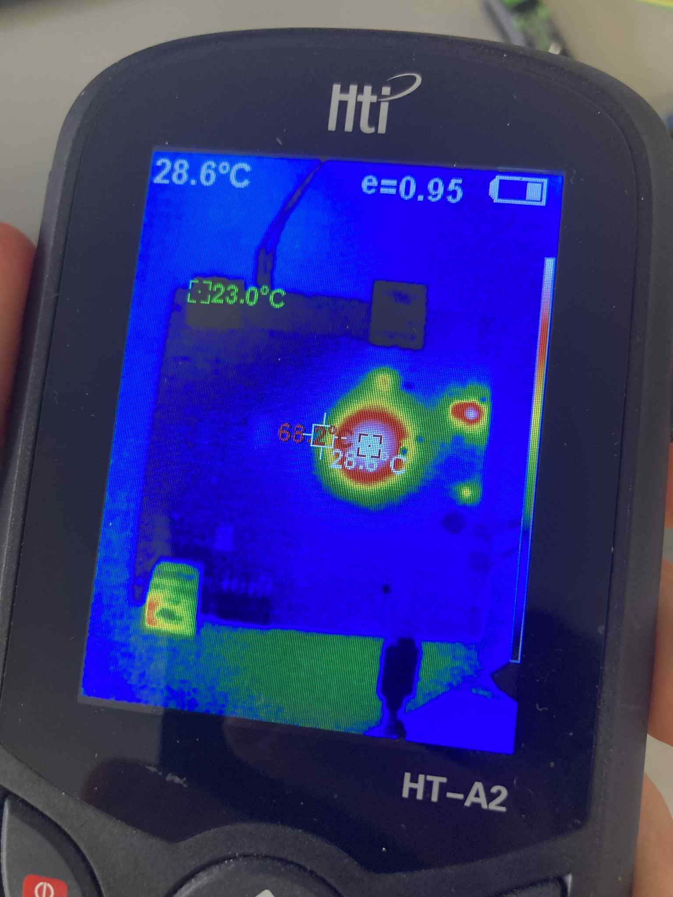
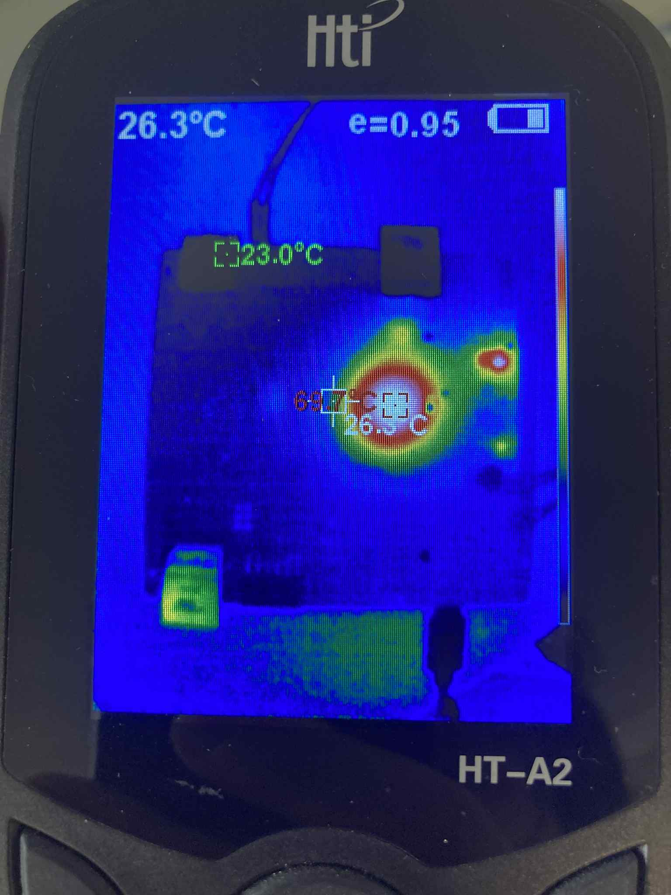
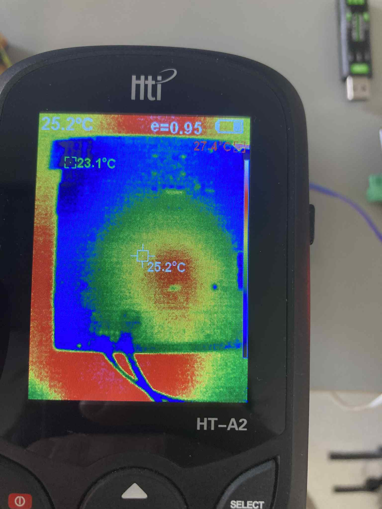

# Test-setup

Since

- the FPGA heats up on power-up
- the voltage doesn't increase beyond 3V3

The short is probably located in this 3V3 region of the FPGA.

We can check this by
- Viewing the FPGA through a thermal camera while powering
- Removing power from each of the regions (3V3, 1V2, 2V5) to see where specifically the short took place
- Removing the BGA package, checking for shorts underneath the package.
- Doing an X-ray of the package

## Thermal camera view
The image clearly indicates high thermal load in the BGA, so likely a short.
It also physically feels hot, especially on top of the BGA package and the DC-DC converter meant to supply the 3V3 power plane.

## Removing 3V3
When removing the 3V3 power, power consumption is minimal / nonexistant

## Removing the BGA
- After removing the BGA
	- Applying solder flux
	- Heating up with a hot air gun
	- Removing with tweezers
- The surface looks ok (no solder smeared anywhere)
- The BGA package doesn't look damaged

## Align the images

Below the images can be found of the BGA footprint, the package and the BGA IC all aligned.

## X-ray
Good addresses:
- https://www.helmholtz-berlin.de/forschung/oe/se/struktur-dynamik-energiematerialien/instrumentation/xraylab/index_en.html (helmholtz Berlin in Adlershof)

